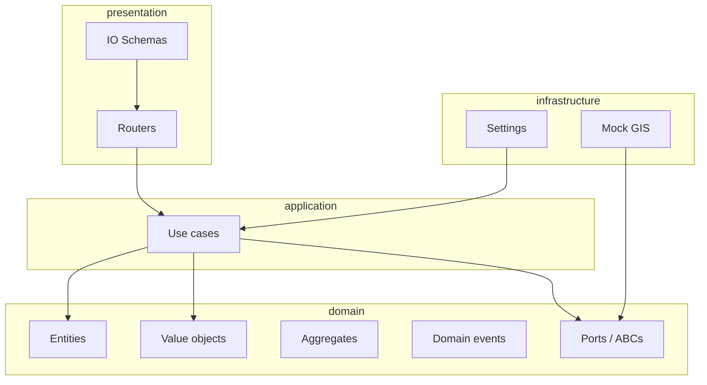

# Car Insurance Premium Simulator — Execution Plan

This document is the canonical phased implementation plan for this repository. Sync edits here when the approach changes.

## Progress checklist

- [x] Phase 0 — Tooling (`pyproject.toml`, Ruff, extended `scripts/check_order.py`, pre-commit)
- [x] Phase 1 — Domain (`domain/`: entities, value objects, aggregates, events, ports, pure math)
- [x] Phase 1.1 — Domain tests & CI quality gate (pytest + Ruff + honeypot script on GitHub Actions)
- [ ] Phase 2 — Application (`application/`: use cases, DI-friendly services)
- [ ] Phase 3 — Infrastructure (`infrastructure/`: `pydantic-settings`, mock GIS)
- [ ] Phase 4 — Presentation (`presentation/`: FastAPI routers, IO schemas)
- [ ] Phase 5 — Docker (`Dockerfile`, `docker-compose.yml`)
- [ ] Phase 6 — Tests and docs (pytest, readme updates as needed)

---

## Context

- **Source of truth for business rules:** [readme.md](readme.md) (rates, premium, policy limit, optional GIS).
- **Alphabetical rule:** Every **parameter list** must be sorted (enforced by [scripts/check_order.py](scripts/check_order.py)). Extend the script so **function and method definition names** are also validated per scope (module-level and per class). **Phase 0** delivers that automation.
- **Stack:** Python 3.11+, FastAPI, Pydantic v2 + `pydantic-settings`, Uvicorn, Docker.



---

## Phase 0 — Tooling, dependency contract, and honeypot checker

### Single source of truth: `pyproject.toml`

Use **setuptools** and **one** `pyproject.toml` (no separate `requirements.txt` unless needed for Docker-only installs later).

- **`[build-system]`** — `requires = ["setuptools", "wheel"]`, `build-backend = "setuptools.build_meta"`.
- **`[tool.setuptools]`** — prefer **`[tool.setuptools.packages.find]`** with `where = ["."]` (or `src/`) once package roots exist so `domain`, `application`, `infrastructure`, `presentation` are installed in editable mode.
- **`[project]`**
  - **`name`:** e.g. `car-insurance-premium-simulator`.
  - **`requires-python`:** `>=3.11` (or `>=3.12` if the team standardizes on 3.12).
  - **`dependencies`** (runtime only): `fastapi`, `uvicorn[standard]`, `pydantic`, `pydantic-settings` — pin with `==` when implementing.
- **`[project.optional-dependencies]` → `dev`:** `ruff`, `pre-commit`, `pytest`, `httpx`, `pytest-cov`, `pytest-xdist`, optional `python-dotenv`, `freezegun` / `faker` only if needed. **No Flake8** — **Ruff** replaces Flake8, isort-style grouping, and pyupgrade-style rules.

### Ruff for lint, format, and import organization

- **`[tool.ruff]`** — `line-length = 120`.
- **`[tool.ruff.lint]`** — `select` includes at minimum: `E`, `F`, `I`, `B`, `UP`, `SIM`, `C4`, `PLC`, `C901`. **Omit `DJ`**. Optionally add **`ASYNC`** if asyncio usage grows.
- **`[tool.ruff.lint.isort]`** — `known-first-party`: `domain`, `application`, `infrastructure`, `presentation` (adjust for `src/` layout).
- Pre-commit: **`ruff format`** → **`ruff check`** → **`python scripts/check_order.py`**.

### Coverage and pytest

- **`[tool.coverage.run]` / `[tool.coverage.report]`** — omit tests, virtualenvs, non-business glue; tune **`fail_under`** after a baseline exists.
- **`[tool.pytest.ini_options]`** — no Django settings. Use e.g. `testpaths = ["tests"]`. If **`asyncio_mode = "auto"`**, add **`pytest-asyncio`** under **dev**.

### Honeypot script and pre-commit

- Fix **`scripts/check_order.py`**: `SyntaxError` path must not return `None`; **`sys.exit(1)`** when the error count is positive; exclude `.venv` / `build` / `dist` explicitly.
- **Extend** the checker for **module-level** and **per-class** alphabetical **definition names** (document **dunder** ordering = strict Unicode sort).
- **`.pre-commit-config.yaml`:** hooks: **`ruff format`** → **`ruff check`** → **`python scripts/check_order.py`**.

---

## Phase 1 — Domain layer (`domain/`)

**No** FastAPI / Pydantic / infrastructure imports.

- **Value objects:** e.g. `Address`.
- **Entity:** `Car` (make, model, value, year).
- **Aggregate root:** optional; keep lean.
- **Domain events:** e.g. premium calculated.
- **Port (ABC):** GIS adjustment port; **parameters alphabetically** on each method.
- **Pure domain math:** rate from age and value chunks (settings passed in, not read from env); policy limit and premium per [readme.md](readme.md).

Naming: **all defs and methods** alphabetized per file/class as enforced by Phase 0.

---

## Phase 1.1 — Domain tests & continuous integration

Follow-up to Phase 1: lock in **automated quality gates** so domain math and tooling rules cannot regress without CI failing.

### Automated tests (pytest)

- **`tests/domain/`** — unit tests for pure domain services (`compute_*` helpers), pinned numeric expectations aligned with [readme.md](readme.md) (e.g. age/value rate example).
- **`tests/test_check_order.py`** — regression tests for [scripts/check_order.py](scripts/check_order.py) (parameter order, module/class/method definition order, CLI exit codes).

Run locally:

```bash
pip install -e ".[dev]"
pytest
python scripts/check_order.py
```

### GitHub Actions workflow

- Workflow file: **[`.github/workflows/ci.yml`](.github/workflows/ci.yml)** (runs on **push** and **pull_request** to the default branch).
- Jobs run **Ruff format** (`--check`), **Ruff lint** (`ruff check`), the **alphabetical-order** script, then **pytest** — same spirit as local **pre-commit**, enforced on every PR.

Python version in CI matches **`requires-python`** (currently **3.11** on `ubuntu-latest`). Extend with a version matrix later if needed.

---

## Phase 2 — Application layer (`application/`)

- Use case orchestrates domain + GIS port.
- GIS variation in **[-0.02, +0.02]** on the derived rate; pick additive vs multiplicative adjustment and document it in one place.
- **Constructor parameters alphabetically** for application services.

---

## Phase 3 — Infrastructure (`infrastructure/`)

- **`Settings`** (`pydantic-settings`): `base_coverage_percentage`, `rate_per_age_year`, `rate_per_value_chunk`, `value_chunk_size` with defaults from the PRD.
- **`MockGisService`:** deterministic mapping from location → variation in **[-2%, +2%]**; implements the domain port.

---

## Phase 4 — Presentation (`presentation/`)

- **Input:** `broker_fee`, `deductible_percentage`, `make`, `model`, `registration_location` (optional), `value`, `year`.
- **Output:** `applied_rate`, `calculated_premium`, `deductible_value`, `make`, `model`, `policy_limit`, `value`, `year`.
- FastAPI router + `Depends()` for settings and GIS port; **`create_app()`** factory.

---

## Phase 5 — Docker and runtime

- **`Dockerfile`:** production-oriented; non-root user; Uvicorn.
- **`docker-compose.yml`:** port mapping, env for settings; optional `/health` healthcheck.

---

## Phase 6 — Tests and documentation

- Unit tests for domain math (readme examples), GIS bounds, `check_order` in CI.
- Integration tests with `httpx` and dependency overrides.

---

## Critical implementation notes

### The architect’s nuance: year / age (keep the domain pure)

One detail in this table deserves extra care when coding: **how “current year” enters the age calculation**.

**Risk:** If you call `datetime.now().year` (or any live clock) inside **`domain/`**, you break **pure, deterministic domain logic**. The same unit test can **pass in one calendar year and fail in the next** (for identical inputs), because age implicitly depends on “today”.

**Senior approach:** The **application layer (use case)** is responsible for capturing “now” once per request—e.g. `datetime.now().year` or, later, an injected **clock port**. It passes that value into the domain as a **plain integer**, e.g. **`current_year: int`**, alongside car year and the rest of the inputs. **Domain** functions then compute vehicle age as a **pure mathematical function** of `(car_year, current_year, …)` with **no `datetime` imports and no system clock**. Unit tests pin `current_year` to a fixed value (e.g. `2026`) and stay stable forever **without** time-mocking libraries such as `freezegun` in domain tests.

Optional: expose **`reference_year`** via settings later if you need replay/backdating; domain still receives an **`int`**, never the clock.

| Topic | Decision |
|--------|----------|
| **Applied rate vs GIS** | Apply GIS after intrinsic age/value rate; document formula briefly. |
| **SOLID / DI** | FastAPI `Depends()` + constructor injection; tests override dependencies. |
| **Alphabetical** | Parameters + definition order enforced by extended checker. |
| **Year / age** | **Application** supplies **`current_year: int`** (resolved per request, typically `datetime.now().year`). **Domain** takes **`current_year`** as an argument; **must not** read the system clock—keeps age math pure and tests deterministic across calendar years. |

---

## Suggested directory tree (target)

```
domain/
  entities/, value_objects/, aggregates/, events/, ports/, services/ (as needed)
application/
  dto/ or commands/, use_cases/
infrastructure/
  config/, gis/
presentation/
  api/, schemas/
main.py
Dockerfile
docker-compose.yml
pyproject.toml
scripts/check_order.py
```
